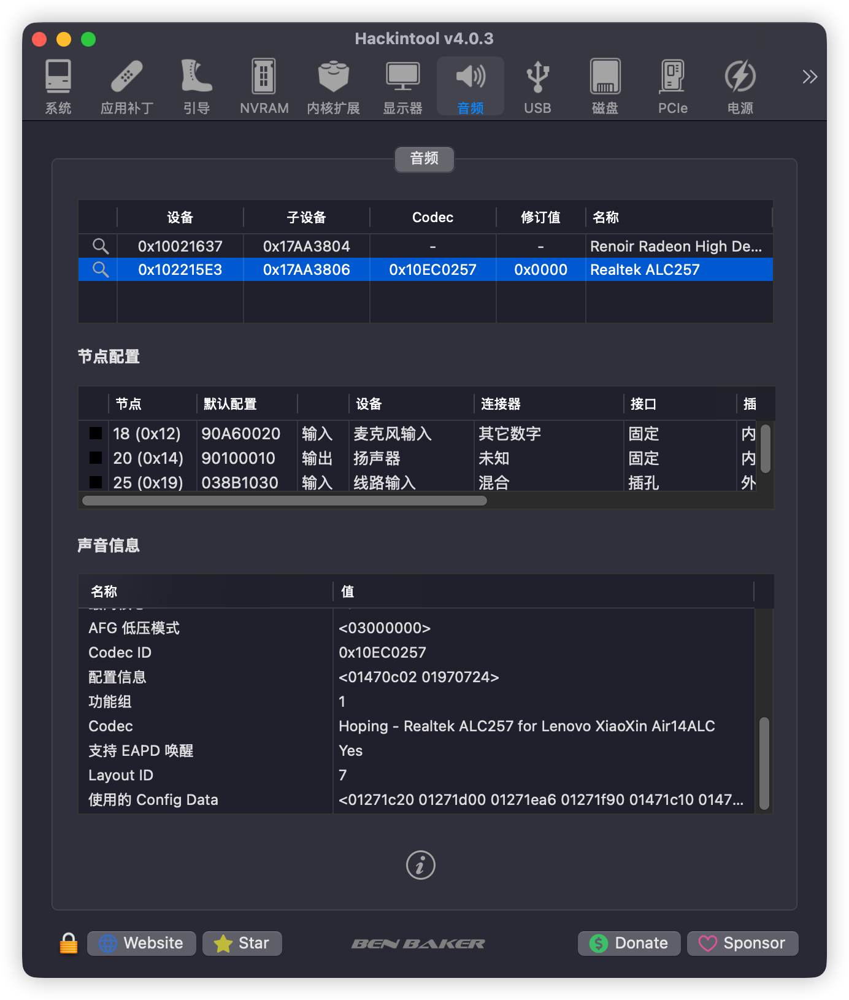

# Lenovo-XiaoXin-Air14-ALC-hackintosh

 

## 说明
1. 睡眠唤醒后亮度调节功能键`Fn+F5`和`Fn+F6`会失效，取而代之的是`Fn+P`和`Fn+K`，暂不清楚啥原因。

### 配置

---

部件|型号|是否支持
:-|:-|:-|
CPU|AMD Ryzen 5 5500U|支持
核显|AMD Radeon Vega 5|支持
网卡|Intel AX200|支持
硬盘|三星PM981A|不支持，更换PM9A1解决
触控屏|I2C HID|支持
键盘|PS2 controller|支持
蓝牙|Intel AX200|支持
HDMI输出||支持
音频/3.5耳机接口|ALC257|支持
内存|镁光DDR4 3200MHz|支持
USB|XCH0、XHC1|支持

---
## 了解你的EFI

---
### ACPI

SSDT | 作用
:---------|:---------
SSDT-ALS0 | NootedRed提供，用于屏幕亮度调整
SSDT-CPUR | 用于MacOS识别CPU，必须
SSDT-PNLF | NootedRed提供，用于屏幕亮度调整
SSDT-SBUS-MCHC | 解决AppleSMBus
SSDT-XOSI | MAC和WIN的ACPI功能，双系统必须

---
### Kexts

Kext | 作用
:---------|:---------
AMDRyzenCPUPowerManagement | AMD CPU 电源管理
AppleALC | 音频驱动
Lilu | 必备
RestrictEvents | CPU改名
SMCProcessorAMD | AMDRyzenCPUPowerManagement的附属
SMCBatteryManager | 电池管理
VirtualSMC | 必备
VoodooPS2Controller | PS/2 键盘，需要在config中禁用voodoops2 input以避免与i2c的input冲突，不影响使用
NootedRed | AMD核显驱动
VoodooI2C | 触控板或触屏驱动
VoodooI2CHID | 触控板或触屏驱动
AirportItlwm | 英特尔网卡驱动，注意不同的系统有不同的kext
BlueToolFixup | 蓝牙驱动，Monterey及以上版本中搭配IntelBluetoothFirmware使用
IntelBluetoothFirmware | 蓝牙驱动
IntelBluetoothInjector | 蓝牙驱动,在Big Sur中搭配IntelBluetoothFirmware使用
IntelBTPatcher | 蓝牙驱动,在Big Sur及以下版本中搭配IntelBluetoothFirmware使用

---

## 截屏

### 以下为MyDevices.kext中的定制结果

### 致谢

---
感谢NootedRed的开发者们，使得AMD核显黑苹果成为可能
>https://github.com/NootInc/NootedRed

以及zabdottler的教程和指导
>https://github.com/zabdottler/Lenovo-Yoga-16S-hackintosh
